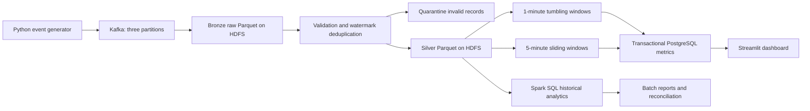

# CS404 Real-Time E-Commerce Analytics Platform

A course project that processes synthetic shopping events using Apache Kafka, PySpark,
Spark SQL, Spark Structured Streaming, HDFS, PostgreSQL, and a Streamlit dashboard.
No machine learning training is required.

**Current status:** the full container stack passed [integration run 37041756610](https://github.com/Owaish0/BDA---Ecommerce-Data-Processing/actions/runs/37041756610):
1,100 accepted events, streaming restart recovery, exact batch reconciliation,
historical reports and browser rendering. All 15 contract/workload/database tests passed.
Extended outage tests and local Windows validation are in progress. See [progress](docs/PROGRESS.md).

## Architecture



The Spark standalone cluster uses a master and worker with multiple executor tasks.
An optional second worker demonstrates scaling. Bronze preserves the Kafka payload,
partition, offset, and ingestion timestamp. Silver stores validated events with
duplicate suppression. Separate queries keep deduplication and aggregation state isolated.

## Quick start on Windows

Prerequisites: Docker Desktop running with Linux containers and Compose v2. Budget
approximately 12 GB for Docker for the full stack; actual requirements must be measured.
The optional extra worker needs more memory. Initial builds download Spark, Hadoop,
Python packages, and the Kafka connector.

```powershell
cd <project-directory>
./scripts/bootstrap.ps1
# If Docker is not on PATH:
./scripts/bootstrap.ps1 -DockerPath "$env:LOCALAPPDATA\Programs\DockerDesktop\resources\bin\docker.exe"
```

Bootstrap creates an ignored `.env` with a random local database password, checks Docker,
and builds the services. Wait for initial builds and startup microbatches.

Open:

- Dashboard: http://localhost:8501
- Spark master: http://localhost:8080
- HDFS NameNode: http://localhost:9870

The dashboard reads actual PostgreSQL results. It does not fabricate charts when the
pipeline is unavailable. Prices are INR; computations use integer paise.

## Operation

```sh
docker compose ps
docker compose logs --tail=100 streaming
docker compose logs --tail=100 producer
docker compose stop producer
docker compose run --rm producer python -m ecommerce.producer --rate 500 --count 10000 --scenario burst
docker compose start producer
docker compose restart streaming
docker compose --profile batch run --rm batch
docker compose --profile scale up -d spark-worker-2
```

To shut down while retaining data: `docker compose down`. Do not add `-v` unless you
intend to delete all Kafka, HDFS, PostgreSQL, and checkpoint data. Changing a query's
state schema requires a migration and a new checkpoint/query identity; do not casually
delete checkpoints or reuse old database epoch ledgers.

## Tests without Docker

```sh
python -m pip install -e '.[test]'
python -m unittest discover -s tests -v
ruff check .
python -m compileall -q src jobs dashboard scripts
```

PostgreSQL transaction tests require an isolated `TEST_DATABASE_URL`. They truncate
test metric tables; never point that variable at a live project database. GitHub CI
creates a disposable PostgreSQL service for these tests.

Generate a deterministic fixture without Kafka:

```sh
python -m ecommerce.producer --file data/fixture.jsonl --count 10000 --seed 404 --start-time 2026-01-01T10:00:00+00:00
```

See [requirements](docs/REQUIREMENTS.md), [reliability guarantees](docs/RELIABILITY.md),
[professor demo](docs/DEMO.md), and [validation plan](docs/VALIDATION.md).

## Team

| Member | Roll number |
|---|---|
| Harsh Jain | 2023BCS-023 |
| Md Rezaul | 2023BCS-035 |
| Owaish Ansari | 2023BCS-043 |
| Rajat Kumar | 2023BCS-053 |
